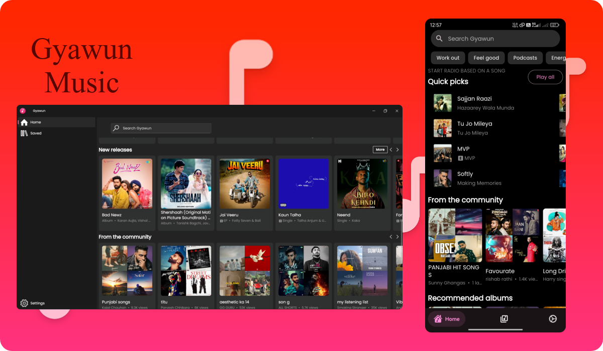

<p align="center">
  
</p>

<h1 align="center">XMusic</h1>
<h3 align="center">Modern Music Player - Fork of Gyawun with Enhanced Features</h3>

<div align="center">
  <a href="https://github.com/hendrilmendes/XMusic/releases/latest">
    
  </a>
  <a href="https://github.com/hendrilmendes/XMusic/commits/main">
    
  </a>
  <a href="https://github.com/hendrilmendes/XMusic/blob/main/LICENSE">
    
  </a>
  <a href="https://t.me/your_channel_link">
    
  </a>
</div>

---

## 🚀 About This Fork
**XMusic** is an enhanced version of the original [Gyawun](https://github.com/jhelumcorp/gyawun) music player, featuring:

✔️ **New UI Improvements**  
✔️ **Additional Audio Features**  
✔️ **Better Performance Optimizations**  
✔️ **Extended Device Compatibility**  
✔️ **Custom Branding and Theming**

---

## 🌟 Key Features
| Feature                | Status | Details                          |
|------------------------|:------:|----------------------------------|
| High Quality Streaming |   ✅   | YouTube Music integration        |
| Background Playback    |   ✅   | Continue music while using apps  |
| Material You Design    |   ✅   | Dynamic theme customization      |
| Local Downloads        |   ✅   | Offline playback support         |
| Advanced Equalizer     |   ✅   | 10-band audio customization      |

---

## 📥 Installation
Download the latest version for Android:

[](https://github.com/hendrilmendes/XMusic/releases/latest)

---

## 🛠 Development Setup
1. Clone the repository:
   ```bash
   git clone https://github.com/hendrilmendes/XMusic.git
   cd XMusic