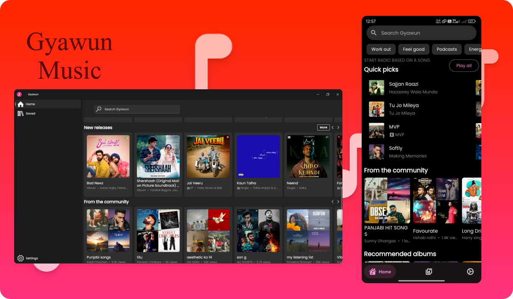

<p align="center">
  
</p>

<h1 align="center">XMusic</h1>
<h3 align="center">Modern, Cross-Platform Music Player (Fork of Gyawun)</h3>

<div align="center">
  <a href="https://github.com/hendrilmendes/Orbit-Music/releases/latest">
    
  </a>
  <a href="https://github.com/hendrilmendes/Orbit-Music/commits/main">
    
  </a>
  <a href="https://github.com/hendrilmendes/Orbit-Music/blob/main/LICENSE">
    
  </a>
  <a href="https://t.me/your_channel_link">
    
  </a>
</div>

---

## 🚀 Sobre o Projeto
**XMusic** é uma versão aprimorada do [Gyawun](https://github.com/jhelumcorp/gyawun). Mantemos a essência de um reprodutor de música elegante e minimalista, mas com diversas expansões em recursos, otimizações e uma base de código moderna. 

O projeto tem suporte nativo para múltiplas plataformas, unindo uma interface limpa baseada no Material You com o poder de fontes de áudio de alta qualidade.

---

## 🌟 Recursos Principais

### 🎧 Áudio & Reprodução
- **Integração com YouTube Music:** Acesse um catálogo virtualmente infinito de músicas em alta qualidade.
- **Reprodução em Segundo Plano:** Escute suas músicas ininterruptamente, mesmo com o aplicativo em background.
- **Equalizador de 10 Bandas Avançado:** Personalize o áudio com suporte nativo e controle total nas frequências.
- **Amplificador de Volume (Loudness Enhancer):** Para dar aquele boost extra no volume.
- **Modos de Reprodução:** Suporte total para repetir tudo, repetir uma, modo aleatório (shuffle) e fila dinâmica de reprodução.
- **Sem Interrupções de Silêncio:** Opção integrada para pular o silêncio entre as músicas (Skip Silence).

### 🎨 Design & Personalização
- **Material You (Dynamic Colors):** A interface do app se adapta dinamicamente às cores do álbum/capa que está tocando ou ao tema do sistema.
- **Design Minimalista e Elegante:** Foco puramente na música, com animações suaves e sem poluição visual.

### 📶 Modo Offline
- **Downloads Locais:** Faça download das suas faixas favoritas e escute em modo offline, não importa onde você esteja.

### 💻 Multiplataforma
- Total suporte para **Android**, **iOS** e com reprodutor nativo modernizado para sistemas desktop como **Linux** e **Windows** usando APIs avançadas de áudio.

---

## 📥 Instalação

Faça o download da versão mais recente:

[](https://github.com/hendrilmendes/Orbit-Music/releases/latest)

*(As versões para Linux e Windows podem ser compiladas localmente utilizando o Flutter SDK)*

---

## 🛠 Como Contribuir / Desenvolvimento

O XMusic é desenvolvido utilizando **Flutter** e **Dart**.

1. Clone o repositório:
   ```bash
   git clone https://github.com/hendrilmendes/Orbit-Music.git
   cd XMusic
   ```

2. Instale as dependências:
   ```bash
   flutter pub get
   ```

3. Execute o aplicativo (conecte seu dispositivo, emulador ou rode nativamente no desktop):
   ```bash
   flutter run
   ```

---

## 📜 Licença e Créditos

- Este projeto é um *fork* do incrível [Gyawun](https://github.com/jhelumcorp/gyawun). Todo o crédito da ideia e da base de código original pertencem aos seus desenvolvedores.
- O código-fonte do XMusic está sob a mesma licença do repositório original (GPL-3.0 License). Verifique o arquivo `LICENSE` para mais detalhes.